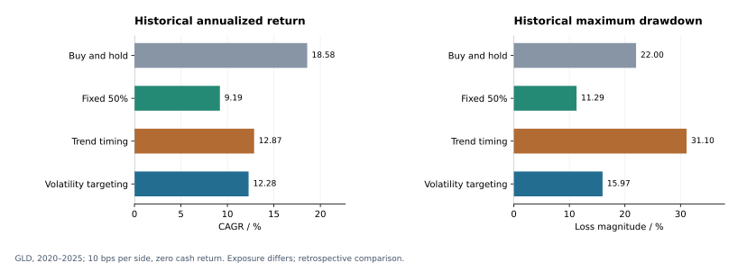
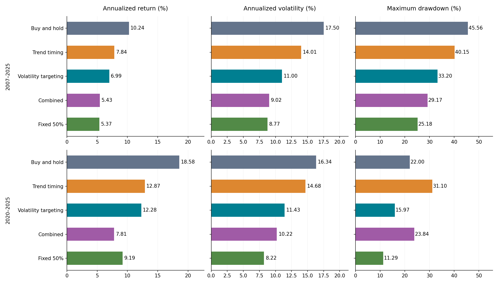

# Gold Allocation Research

**Quantitative Research & Risk Management** · Quantitative Decision Science · Selected Project 03

  

[Portfolio](https://github.com/xsm-math) · [01 Inventory](https://github.com/xsm-math/inventory-allocation) · [02 Credit Risk](https://github.com/xsm-math/Risk-Modeling) · [03 Gold Allocation](https://github.com/xsm-math/invest)

| Project Summary | A single-asset gold/cash allocation study with explicit execution timing and self-financing accounting. |
|---|---|
| Research Question | Does trend timing improve gold allocation relative to volatility targeting and passive exposure? |
| Methods | Moving-average signals, volatility sizing, monthly rebalancing, transaction-cost accounting, rolling parameter selection and paired block bootstrap. |
| Key Results | In 2020–2025, volatility targeting has **12.28% CAGR / 15.97% drawdown**, versus trend timing **12.87% / 31.10%**. In 2015–2025, rolling selection has **4.33% CAGR**, below fixed 50% gold/cash **6.10%**. |
| Evidence | [Fixed-rule metrics](reports/reference/metrics.csv), [rolling comparison](reports/reference/walk_forward_comparison.csv), [manifest](reports/reference/run_manifest.json). Retrospective results, net of assumed 10 bps per side; this is not a diversified multi-asset study. |



[Research report](reports/reference/REPORT.md) · [Methodology](docs/METHODOLOGY.md) · [References](docs/REFERENCES.md)

## Abstract

This study compares trend timing, volatility targeting, their combination and passive GLD/cash allocations using explicit costs and rolling evaluation. It examines risk–return trade-offs and retains negative benchmark results. The current asset-allocation scope is one traded asset plus cash; multi-asset portfolio optimization remains future work.

## Problem Definition

Separate return timing from exposure control: evaluate whether a trend signal adds value beyond a volatility sizing rule and simpler passive allocations. Compare return, volatility, drawdown and turnover under the same execution convention.

## Mathematical Formulation

Let $P_t$ be the adjusted close, $r_t=P_t/P_{t-1}-1$ and $\widehat\sigma_t=\sqrt{252}\,sd(r_{t-59:t})$. The trend indicator is $I_t=1\{P_t>MA_{200,t}\}$. Volatility targeting uses $a_t=\min(1,0.10/\max(\widehat\sigma_t,0.01))$; the combined target is $I_ta_t$.

For pre-trade wealth $V$, existing gold value $A$, proportional cost $c$ and target $w$, post-trade gold value satisfies $X=w(V-c|X-A|)$. This defines a self-financing shares-and-cash account rather than applying daily target weights retrospectively. [The full formulation](docs/METHODOLOGY.md) specifies purchases, sales and cash balances.

## Data

The reference download contains 5,283 adjusted daily GLD prices from 2005-01-03 through 2025-12-31. Results are USD-denominated, use one vendor and are not independently verified against exchange data. [Data provenance](data/README.md) and [the run manifest](reports/reference/run_manifest.json) retain the source and SHA256.

## Methodology

- **Trend timing:** full gold exposure when price exceeds its 200-session moving average; cash otherwise.
- **Volatility targeting:** exposure equals 10% divided by estimated annualized volatility, capped at 100%. Volatility is estimated from 60 daily returns and floored at 1%.
- **Combined:** the trend indicator multiplied by volatility-targeted exposure.
- **Benchmarks:** buy-and-hold and monthly rebalanced 50% gold/50% cash.

Signals observed at the previous close execute at the first trading-day close of each month. Costs are 10 bps per side; cash earns zero. The portfolio is long-only and unlevered. The volatility target is a sizing parameter, not a loss limit.

## Experimental Design

Fixed rules use 2005–2006 for indicator warm-up and evaluate 2007–2025, with 2020–2025 reported as a contained historical subperiod. Each 2015–2025 rolling test year selects one of nine combined-rule specifications by net Sharpe on the preceding five calendar years. Parameters are frozen for the next year and holdings/costs carry across boundaries. Paired circular block bootstrap uses 20-session blocks and 2,000 replications for annualized arithmetic return differences; it does not form a CAGR interval or repeat selection in each resample.

## Results

**2020–2025 historical subperiod; net of assumed trading costs.**

| Strategy | CAGR | Volatility | Maximum drawdown |
|---|---:|---:|---:|
| Buy and hold | 18.58% | 16.34% | 22.00% |
| Trend timing | 12.87% | 14.68% | 31.10% |
| Volatility targeting | 12.28% | 11.43% | 15.97% |
| Combined | 7.81% | 10.22% | 23.84% |
| Fixed 50% | 9.19% | 8.22% | 11.29% |



*Annualized return, volatility, and maximum drawdown for the full sample and recent subperiod. Scales are shared within columns; drawdowns are positive loss magnitudes.*

Volatility targeting reduced drawdown relative to trend timing at a 0.59-percentage-point annual return cost in the recent subperiod. Combining the rules did not improve that trade-off. Over the full sample, the combination reduced drawdown further but also reduced returns. Annual rolling parameter selection did not outperform the fixed-weight benchmark. These retrospective findings do not establish return predictability or prospective outperformance.

The [full report](reports/reference/REPORT.md) retains 2007–2025 and 2015–2025 tables, turnover and uncertainty. Rolling selection returns 4.33% CAGR versus 6.10% for fixed 50% on a common 2015–2025 start.

## Robustness and Sensitivity Analysis

[Transaction-cost sensitivity](reports/reference/cost_sensitivity.csv) covers 0/5/10/20/50 bps per side; combined-rule 2020–2025 CAGR declines from 8.08% at zero cost to 6.72% at 50 bps. [Post-hoc parameter sensitivity](reports/reference/sensitivity_POSTHOC.csv) records moving-average/volatility-target variations and is descriptive, not an independent selection set.

The rolling strategy's annualized mean daily-return difference versus fixed 50% is −1.61%, with a paired 95% block-bootstrap interval of [−4.62%, 1.42%]. This does not establish prospective underperformance or outperformance; researcher selection and multiple comparisons remain.

## Business Interpretation

Volatility sizing controls exposure and reduced drawdown versus trend timing in the recent subperiod, with lower return. The combined rule did not improve that trade-off, and a fixed 50% allocation remained competitive. These findings motivate simple risk benchmarks before adding signal or selection complexity. Unequal exposure prevents a causal interpretation of timing value.

## Limitations

Single-asset, retrospective data and a single vendor limit external evidence. Cash earns zero; taxes, FX, market impact beyond proportional costs and integer shares are omitted. Rolling selection limits direct look-ahead but does not remove researcher selection bias. A 10% volatility target is a sizing parameter, not a guaranteed realized volatility or loss ceiling. Benchmarks are not exactly risk-matched; this is not a live trading system.

## Future Work

Add independently sourced histories, interest-bearing cash and exposure-matched benchmarks; extend to several assets with explicit covariance estimation and portfolio constraints; reserve later data before selecting specifications; reassess results under alternative execution and transaction-cost assumptions.

## Repository Structure

| Directory | Role |
|---|---|
| `src/gold_research/` | Signals, self-financing engine, metrics, walk-forward selection and reporting |
| `configs/`, `data/` | Reference configuration and market-data provenance; raw data stays local |
| `tests/` | Accounting, timing, future-data isolation and year-boundary checks |
| `reports/reference/` | Committed aggregate metrics, figures and manifests |
| `reports/generated/` | New runs, separate from reference results |
| `docs/`, `notebooks/` | Methodology, references and research walkthrough |
| `scripts/`, `assets/portfolio/` | Presentation-only summary and input hashes |

## Reproducibility

From the repository root, Python 3.10+:

```bash
git clone https://github.com/xsm-math/invest.git
cd invest/gold-strategy-research
python -m pip install -e .
python -m gold_research download
python -m gold_research run
python -m unittest discover -s tests -v
```

Raw data is excluded from Git and download failure is not replaced with synthetic data. New experiment outputs go to `reports/generated/`; committed reference outputs remain in `reports/reference/`. [The manifest](reports/reference/run_manifest.json) records the retrieved data hash, date range and software versions. A changed vendor history may not match the reference hash.

Presentation-only reference summary: `python scripts/portfolio_summary.py --project gold`; [input hashes](assets/portfolio/manifest.json) identify its CSV evidence. Reference prose must be reassessed when configuration or data changes.
