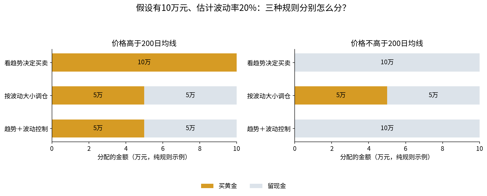

# 黄金投资研究：什么时候买，买多少？

如果已经决定配置黄金，**一直拿着、看趋势进出、市场起伏大时少买一点，哪一种更合适？**这个项目用历史数据比较三种做法，既看最后赚多少，也看中途可能多难受。

**第一次看，建议从[通俗图解](reports/reference/BEGINNER.md)开始。**不需要先学会金融术语或读Python代码。

## 一分钟弄清两种方法

- **趋势择时，决定买不买。**价格高于过去200个交易日的均价，就买黄金；否则留现金。不是看今天红了还是绿了。
- **波动率控制，决定买多少。**最近60个交易日越颠簸，黄金买得越少。比如估计波动20%、目标10%，就买一半黄金，留一半现金。它不预测下一步涨跌。
- **两者组合，先看方向再定金额。**趋势不满足就不买；满足时再按波动大小分配资金。



图中是假设有10万元的规则演示，**不是投资建议或历史收益**。两边仅改变“价格是否高于均价”，估计波动均为20%。看现金和黄金的金额，就能分清三种规则。

## 先把收益和风险分开看


左列是**赚了多少**，越长表示年化收益越高；中列是**平时多颠簸**，越短越平稳；右列是**从曾经的最高点最深跌过多少**，越短越好。上排为2007—2025，下排为2020—2025。

不要把“波动率10%”读成“最多亏10%”。日常起伏和最深下跌是两个不同的问题，通俗图解里用“10万→12万→9万”的例子解释了区别。

## 数字说明了什么？

2020—2025年，买卖成本均按成交金额的0.1%计算，现金不计息。这里的“年化收益”是整段历史换算出的复合年增长速度，不是每年稳定赚这么多。

| 怎么做 | 年化收益 | 从高点最深跌过多少 |
|---|---:|---:|
| 一直持有黄金 | 18.58% | 22.00% |
| 看200日趋势进出 | 12.87% | 31.10% |
| 按波动大小调仓 | 12.28% | 15.97% |
| 趋势＋波动控制 | 7.81% | 23.84% |
| 始终一半黄金、一半现金 | 9.19% | 11.29% |

**在本次历史样本中，单独按波动大小调仓，比看200日趋势进出更能降低风险。**代价是年化收益少0.59个百分点，换来最深回撤少15.13个百分点。

**加一个规则，不一定更好。**组合策略比单独波动控制赚得少，这段历史里的最深下跌还更大。不过，全样本里组合回撤较浅、收益也较低，不能把某一个阶段的结果推广到所有时期。

**也要和简单方法比。**固定一半黄金的做法，近期收益和回撤都优于组合。复杂策略需要证明自己的额外价值，不能只展示赚钱曲线。

这是既定历史规则的比较，不是在预测现在该不该买黄金。GLD以美元交易，结果未换算人民币，也没有把你的其他资产、资金用途和承受能力放进模型。

## 按这个顺序阅读

| 想弄清什么 | 看哪里 |
|---|---|
| 术语、10万元例子、每张图怎么读 | [通俗图解 BEGINNER](reports/reference/BEGINNER.md) |
| 精确参数、全样本数字、策略之间差多少 | [数字比较 COMPARISON](reports/reference/COMPARISON.md) |
| 过去五年选参数、下一年测试，结果如何 | [完整报告 REPORT](reports/reference/REPORT.md) |
| 想逐步运行、查看数据表 | [学习Notebook](notebooks/research_walkthrough.ipynb) |
| 想核查公式和交易费用怎么算 | [数学与记账方法](docs/METHODOLOGY.md) |
| 参考了哪些GitHub项目 | [参考来源](docs/REFERENCES.md) |

## 自己运行

Python 3.10或更新版本。先进入本项目目录（不是invest仓库根目录）：

```bash
cd gold-strategy-research
python -m venv .venv
# Windows PowerShell: .venv\Scripts\Activate.ps1
# macOS/Linux: source .venv/bin/activate
python -m pip install -e .
python -m gold_research download
python -m gold_research run
python -m unittest discover -s tests -v
```

`download`获取2005—2025年的GLD行情，前两年用于计算指标；`run`生成策略结果、图表和报告。新输出在`reports/generated/`，已提交的参考结果在`reports/reference/`。行情不随Git仓库提交，下载失败会报错，不会悄悄用模拟数据替代。

新图若找不到中文字体会使用英文标签，中文导读仍可阅读。要生成中文图，可安装Noto Sans CJK SC等中文字体，或设置环境变量`GOLD_RESEARCH_CJK_FONT`指向本机中文字体文件。无需更改模型。

实验参数在`configs/default.json`；实际数据哈希与依赖版本在`reports/reference/run_manifest.json`。当前通俗文字解读针对本次默认参数的参考实验；若修改参数，应结合新指标重新审阅结论，不能直接沿用旧判断。

## 代码怎么分工？

| 文件 | 通俗理解 |
|---|---|
| `data.py` | 取价格、检查数据有没有明显问题 |
| `strategies.py` | 决定下一次应该买多少黄金 |
| `engine.py` | 记账：持有多少、现金多少、每笔费用多少 |
| `walkforward.py` | 只用过去选参数，再看下一年效果 |
| `reporting.py`、`comparison.py` | 把数字写成研究报告 |
| `beginner.py` | 生成通俗导读和解释图 |
| `tests/` | 检查记账、时间顺序和跨年衔接是否正确 |

本地11项测试通过；远端测试状态看GitHub Actions。研究保留未跑赢基准的结果，不将历史模拟称为实盘业绩。
