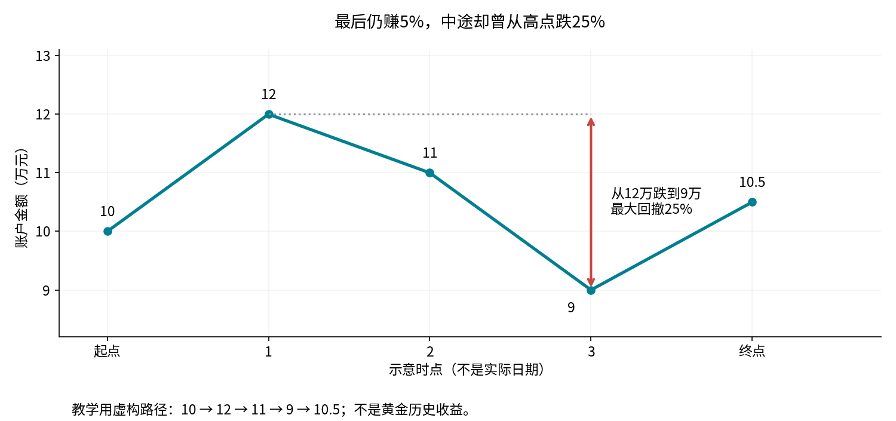

# 黄金策略研究：先读这一篇

我们研究的不是“黄金明天会涨吗”，而是：**如果决定长期配置黄金，要一直拿着、看趋势进出，还是市场起伏大时少买一点？减少难受的下跌，要牺牲多少收益？**

这里只讨论已经发生的历史。研究标的是用美元交易的黄金基金GLD，可把它理解为用基金份额持有黄金价格敞口；不是金矿股票，也不是人民币金价。

## 1. 两个名字，其实是在回答不同问题

**趋势择时：决定买不买。**把今天价格与过去200个交易日的平均价格比较。高于平均价，下次调仓时全部买黄金；否则全部留现金。200个交易日不是200个自然日。“高于均价”也不等于今天上涨，更不保证明天上涨。

**波动率控制：决定买多少。**看最近60个交易日价格来回起伏有多大。波动大，少放些钱；波动小，多放些钱，上限是全部资金。它不判断价格方向，大涨和大跌都可能让波动变大。

**组合策略：先决定买不买，再决定买多少。**趋势不满足就留现金；趋势满足时，再按波动大小分配金额。

## 2. 用10万元看清怎么操作

这是规则演示，与真实美元回测分开。假设估计年化波动率为20%，希望按10%的目标控制持仓：10% ÷ 20% = 50%，所以买5万元黄金、留5万元现金。

左图价格高于200日均价：趋势策略买10万，波动策略买5万，组合也买5万。右图价格不高于均价：趋势和组合都不买，波动策略仍买5万。**这正是两种方法的区别：一种看方向，一种看起伏。**

“目标波动10%”不是承诺“最多亏10%”。它用过去数据估计仓位，未来可能突然剧烈变化，而且本项目一个月才调整一次。现金留在账户里，默认不计利息。

## 3. 四个术语，用一句话读懂

| 名称 | 通俗解释 | 不要误读成 |
|---|---|---|
| 仓位 | 账户里有多少比例的钱买了黄金。50%就是一半买黄金、一半留现金 | 买入次数，或必然的风险大小 |
| 年化收益 | 把整段历史收益换算成等效的每年复合增长速度 | 每年都能稳定赚这么多 |
| 年化波动率 | 每天涨跌的分散程度，再换算成年尺度，表示日常起伏大小 | 最多会亏多少，或未来亏损概率 |
| 最大回撤 | 曾经的最高账户金额，到后来最低点之间最深的一次下跌比例 | 期末最终亏了多少 |

10万元先涨到12万，再跌到9万，这段回撤为(12−9)÷12=25%。后来回到10.5万，最终仍比起点多5%。所以“最后赚钱”和“中途非常难受”可以同时发生。这条路径是教学例子，不是实际黄金数据。

其他术语：**调仓/再平衡**是按规则重新分配黄金和现金；**基准**是拿来比较的简单做法；**回测**是把历史价格放进规则做模拟；**净值**是把账户起点设为1，1.2表示累计增加20%。买卖各收0.1%的费用，交易5万元时一次约50元；这是假设，不是所有券商的实际收费。

## 4. 读图时，把三个问题分开

从左到右依次看：**赚了多少、平时多颠簸、中途最深跌多少。**左列一般越长越好，右两列一般越短越好。不能选最长的所有柱子，也不能只看收益。

上排是2007—2025，下排是2020—2025；同一列使用相同刻度，方便对照。不同行的历史长短不同，不能据此说未来一定保持某个水平。2020—2025包含在全样本中，它们不是两份互相独立的证据。

右下角最值得注意：趋势策略回撤31.10%，单独波动控制15.97%，组合23.84%。组合虽然日常起伏更小，却没有更浅的最深下跌；这说明“波动小”和“回撤小”不是同一个概念。

## 5. 钱是怎样走到终点的？

**先看上图：**五个账户在2019年末都折算为10万美元。越往上，账户金额越大；不是每一年都按年化收益稳定增长。图例括号是2025年末的金额，单位万美元。

**再看下图：**每条线都在问“当前比自己此前最高点低了多少？”线越往下，投资者从曾经的最高金额跌得越深。0表示当前就在这一段的最高点。不同策略的最低点可能发生在不同日期，不表示它们同一天遭受相同冲击。

账户继承原先的持仓，只为便于比较而统一起始金额；不是在2020年重新买入。使用美元，没有计算人民币汇率变化。图表采用普通金额刻度，技术报告原有长周期图使用对数刻度：后者相同垂直距离代表相同涨跌比例，不代表相同金额。

## 6. 用一笔账户金额再比较一次

以下将2019年末的原有策略账户都折算为10万美元，继续原有持仓，观察到2025年末；已计入模拟交易费用。

| 怎么做 | 六年后账户折算金额 | 年化收益 | 中途最深回撤 |
|---|---:|---:|---:|
| 一直持有黄金 | 27.73万美元 | 18.58% | 22.00% |
| 看趋势决定买卖 | 20.64万美元 | 12.87% | 31.10% |
| 按波动大小调仓 | 20.00万美元 | 12.28% | 15.97% |
| 趋势＋波动控制 | 15.68万美元 | 7.81% | 23.84% |
| 始终一半黄金 | 16.93万美元 | 9.19% | 11.29% |

账户终值根据逐日收益累计得到，不是把四舍五入后的年化收益简单乘六年；技术指标按一年252个交易日换算，与实际自然年长度可能略有差异。

**直接比较趋势与波动控制：**后者年化收益从12.87%变为12.28%，少0.59个百分点；最大回撤从31.10%变为15.97%，少15.13个百分点。“个百分点”表示相减，不是“少赚0.59%的总金额”。两种方法的账户金额和回撤取舍，都应一起看。

## 7. 所以，到底得出了什么？

**在本次参数和历史样本中，如果关心的是减少日常起伏和深度回撤，单独按波动大小调仓，比200日均线进出更有支持。**但它没有满仓持有赚得多，也没有证明有预测金价的能力。

**把两个规则叠加，不会自动变得更好。**2020—2025年，组合的收益比单独波动控制少，回撤反而更深；在2007—2025全样本，组合回撤更浅，但又少赚了一部分。不能笼统说“复杂策略全面胜出”。

**简单方法也很强。**始终一半黄金、一半现金，近期年化收益9.19%、最大回撤11.29%；复杂组合是7.81%、23.84%。这提醒我们：少买一些本身就能减少风险，不能把所有风险下降都当作择时成功。

它也不是“任何人都该买一半黄金”的建议。这里没有考虑你的总资产、资金用途、实际利息或人民币汇率；当前结论只评价这些既定历史规则。

## 8. 为什么还要滚动测试？

如果看完历史，再挑过去最赚钱的参数，就像先看答案再参加考试。为减少这种偏差，本项目每次只看过去五年，选出参数，下一年暂时不改，再检验效果。之后向前挪一年重复。

这叫“滚动检验”（walk-forward）。跨年账户不清零，换规则也要付交易费。它更接近当时逐步决策的过程，但仍不是在未来真正实盘做过：研究者今天选择研究哪些规则，本身也会影响结论。

报告里的“夏普”粗略表示单位起伏对应多少平均收益，只作辅助，不能理解为胜率；本项目把无风险收益设为0。“bootstrap区间”是把收益按一段一段反复抽取，观察结论多不稳定；不是未来赚钱概率。“样本外”表示某段数据没有用于那一次选参，不代表整个研究从未接触过它。

## 9. 下一步读哪里

- [精确参数与差值表](COMPARISON.md)：核对每一项数字。
- [完整技术报告](REPORT.md)：滚动选参、成本、不确定性与局限。
- [数学和记账方法](../../docs/METHODOLOGY.md)：想核查公式时再读。

图1的资金分配和图2的回撤路径是教学示例；比较柱图和账户曲线来自实际回测。历史结果不保证未来表现。
