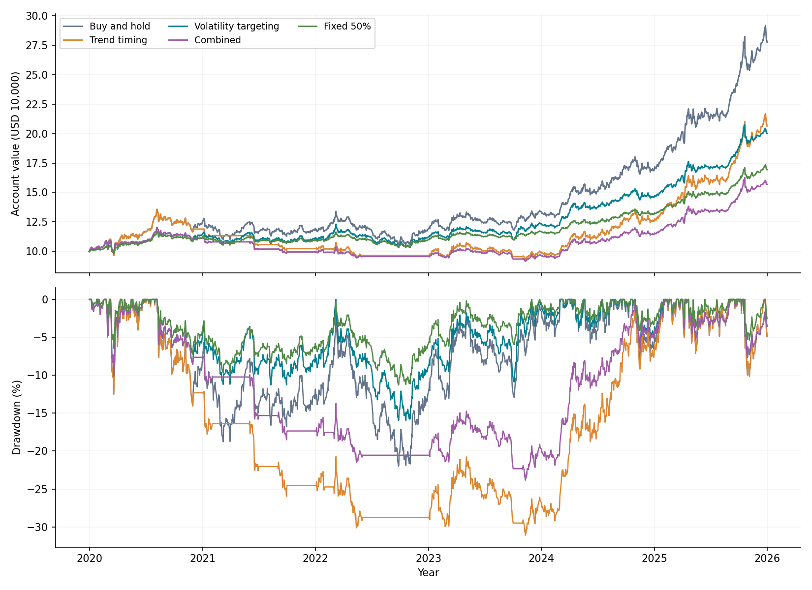

# Trend Timing and Volatility Targeting in Gold Allocation

## Abstract

This study evaluates monthly allocation rules for SPDR Gold Shares (GLD). A moving-average filter is compared with volatility targeting, their combination, and passive allocations. In 2020–2025, volatility targeting returned 12.28% annually with a maximum drawdown of 15.97%, compared with 12.87% and 31.10% for trend timing. Under the reference specification, volatility targeting reduced risk at a modest return cost relative to trend timing. Combining the two rules did not improve the recent-period return–drawdown trade-off.

## 1. Data and specification

Daily adjusted GLD closing prices cover 2005–2025; 2005–2006 provide indicator warm-up. Fixed-rule evaluation begins on 2007-01-01. Results are denominated in USD. The analysis uses a single vendor and does not independently verify exchange data.

Trend timing allocates fully to gold when the closing price exceeds its 200-session moving average and otherwise holds cash. Volatility targeting sets gold exposure to min(1, 10.00%/max(estimated volatility, 1%)), using the sample standard deviation of 60 daily returns, annualized by √252. The combined rule multiplies this exposure by the trend indicator. All exposures are long-only and capped at 100%.

Buy-and-hold and monthly rebalanced 50% gold/50% cash serve as benchmarks. An auxiliary mean-reversion rule holds gold when the 20-session price z-score is below −1.5; it is evaluated at the same monthly frequency.

Signals observed at the previous close are executed at the first trading-day close of each month. Existing holdings earn the execution-day return. Costs are 10 basis points per unit of traded value, per side; cash earns a constant 0.00%. Holdings drift between rebalances. Taxes, integer share constraints, and market impact beyond the cost assumption are excluded. Terminal positions are marked to market without liquidation.

## 2. Fixed-rule results

**Table 1. Full sample, 2007–2025.**

| Strategy | CAGR | Volatility | Sharpe | Max. drawdown | Annual turnover |
|---|---:|---:|---:|---:|---:|
| Buy and hold | 10.24% | 17.50% | 0.64 | 45.56% | 0.05 |
| Fixed 50% | 5.37% | 8.77% | 0.64 | 25.18% | 0.14 |
| Trend timing | 7.84% | 14.01% | 0.61 | 40.15% | 1.84 |
| Volatility targeting | 6.99% | 11.00% | 0.67 | 33.20% | 0.89 |
| Combined | 5.43% | 9.02% | 0.63 | 29.17% | 1.83 |
| Mean reversion | 2.38% | 5.01% | 0.49 | 9.95% | 2.21 |

**Table 2. Historical subperiod, 2020–2025.**

| Strategy | CAGR | Volatility | Sharpe | Max. drawdown | Annual turnover |
|---|---:|---:|---:|---:|---:|
| Buy and hold | 18.58% | 16.34% | 1.13 | 22.00% | 0.00 |
| Fixed 50% | 9.19% | 8.22% | 1.11 | 11.29% | 0.10 |
| Trend timing | 12.87% | 14.68% | 0.90 | 31.10% | 2.34 |
| Volatility targeting | 12.28% | 11.43% | 1.07 | 15.97% | 1.02 |
| Combined | 7.81% | 10.22% | 0.79 | 23.84% | 2.53 |
| Mean reversion | 2.33% | 4.43% | 0.54 | 7.33% | 2.00 |

*Figure 1. Annualized return, annualized volatility, and maximum drawdown. Scales are shared within each column. Drawdown is reported as a positive loss magnitude. The subperiod is contained in the full sample; these are not independent replications.*

Relative to trend timing in 2020–2025, volatility targeting changed annualized return by -0.59 percentage points and reduced maximum drawdown by 15.13 points. The combined rule returned 7.81% with a 23.84% drawdown. The fixed 50% benchmark returned 9.19% with an 11.29% drawdown. Lower exposure therefore remains an important alternative explanation for apparent risk reduction.

*Figure 2. Existing strategy accounts rebased to USD 100,000 at year-end 2019, with subperiod drawdowns below. Rebased accounts retain prior holdings; they are not newly opened portfolios. The upper panel uses a linear scale.*

## 3. Rolling parameter selection

Each test year uses parameters selected from the preceding 5 calendar years. Nine combinations of moving-average length and volatility target are ranked by training-period net Sharpe ratio. Parameters are frozen for the next year; test holdings and trading costs carry across year boundaries. All comparison accounts below start from cash on the same first test date.

**Table 3. Walk-forward evaluation, 2015–2025.**

| Strategy | CAGR | Volatility | Sharpe | Max. drawdown | Annual turnover |
|---|---:|---:|---:|---:|---:|
| Walk-forward | 4.33% | 8.33% | 0.55 | 20.63% | 2.06 |
| Buy and hold | 12.00% | 14.74% | 0.84 | 22.00% | 0.09 |
| Fixed 50% | 6.10% | 7.42% | 0.84 | 11.29% | 0.14 |
| Combined | 5.09% | 9.12% | 0.59 | 23.84% | 1.99 |

The paired annualized mean daily-return difference between walk-forward allocation and fixed 50% exposure is -1.61%. A circular block bootstrap (20-session blocks; 2000 replications) gives a 95% percentile interval of [-4.62%, 1.42%]. This interval concerns arithmetic mean returns, not CAGR. It neither corrects for multiple specification searches nor repeats parameter selection within each resample.

## 4. Interpretation and limitations

The reference results support volatility targeting as an exposure-control method, rather than evidence of return predictability. The trend filter does not consistently improve the return–drawdown trade-off, and rolling optimization does not outperform the simple fixed-weight benchmark. These conclusions are conditional on the instrument, sample, execution convention, and chosen parameters.

The study is retrospective. Rolling evaluation limits direct look-ahead in parameter selection but does not eliminate researcher selection bias. Historical volatility is not a loss bound. Cash returns, currency conversion, execution frictions, and alternative parameter choices may alter the comparison. The benchmarks are not exactly risk-matched, so performance differences do not identify a causal timing effect.

## Reproducibility

CAGR uses a 252-session annualization convention. Sharpe assumes a zero risk-free rate. Subperiod drawdowns reset the running peak at the subperiod boundary. Source hash: `a97121f4a34408cfa87b2a9a54d7bab4a3f16b2010324dd9b2c00065f0dceddf`. The accompanying CSV files record metrics, candidate scores, selected parameters, and sensitivity results. Data provenance and software versions are recorded in `run_manifest.json`. See [methodology](../../docs/METHODOLOGY.md) and [references](../../docs/REFERENCES.md).
