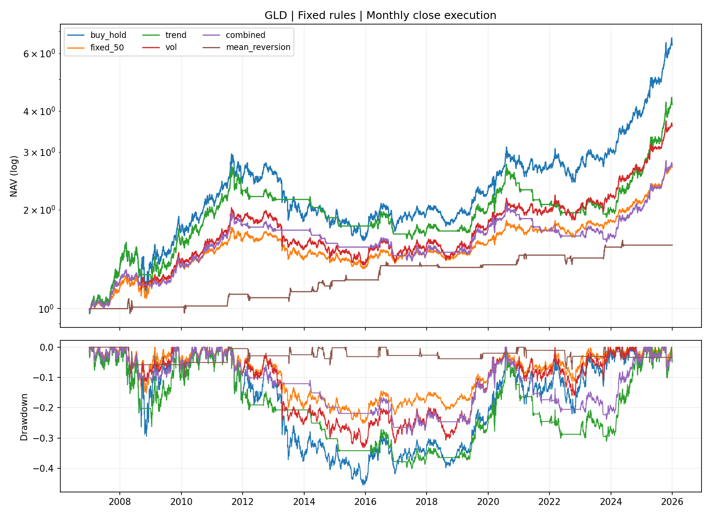
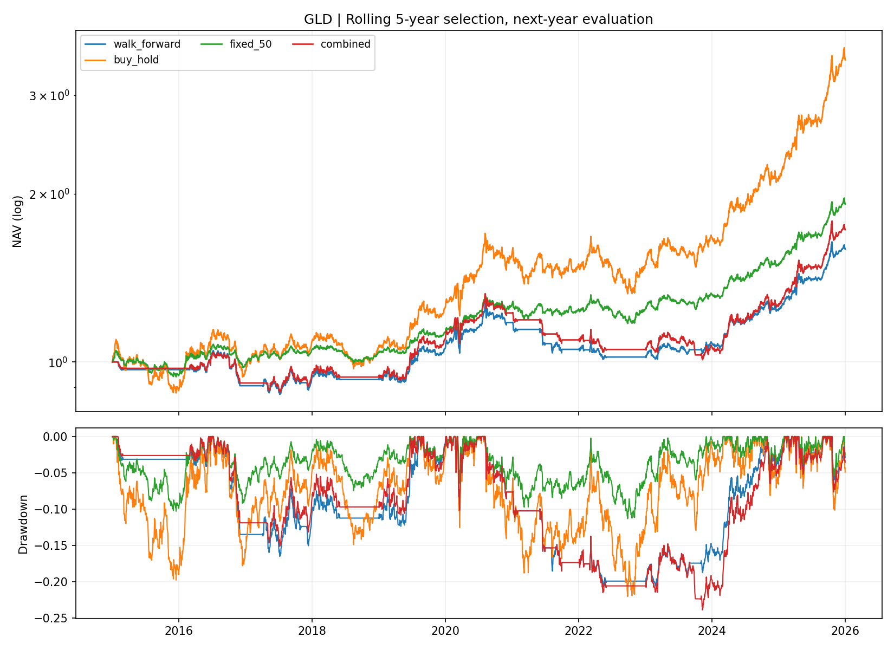

# 黄金策略研究：模块化与滚动检验版

第一次阅读？先看[通俗图解](BEGINNER.md)：术语、资金分配例子，以及每张图的读法。

本报告由本次程序输出生成；价格截至 2026-01-01（不含），数据 SHA256：`a97121f4a34408cfa87b2a9a54d7bab4a3f16b2010324dd9b2c00065f0dceddf`。

## 1. 明确研究问题

**对美元黄金ETF GLD，在相同数据、月度成交规则和交易成本下，200日趋势择时与10%目标波动率控制，谁更能降低风险？降低风险牺牲了多少收益？把两者叠加是否值得？**

主比较使用2007—2025年全样本；2020—2025年单独作为近期历史分段检查，两个区间分别列示，不混用数字。这里的“近期”仅指截至2025年的研究分段，不是当前行情。明确三个判断标准：

1. **趋势择时**：是否在年化收益不低于满仓持有的同时，降低最大回撤？
2. **波动率控制**：是否同时降低年化波动率和最大回撤？同时单独报告收益代价，不将降仓位说成超额收益。
3. **叠加趋势过滤**：相对单独波动率控制，是否在不降低年化收益的同时进一步降低最大回撤？

这是本次报告明确化后的描述性评价标准，不是事前登记的统计假设，也不是唯一可能的投资目标。

## 2. 两种方法的明确数字

| 项目 | 趋势择时（trend） | 波动率控制（vol） |
|---|---|---|
| 输入 | 收盘价与过去200个交易日均价 | 过去60个日收益的样本标准差×√252 |
| 触发或目标 | 收盘价严格高于均价才持有 | 目标年化波动率10% |
| 目标黄金仓位 | 高于均价100%；低于或等于均价0% | min(100%, 10%/max(估计波动率,1%)) |
| 是否判断涨跌方向 | 是 | 否，无论趋势正负都按风险分配仓位 |
| 杠杆与现金 | 无杠杆；未投部分为现金 | 无杠杆；未投部分为现金 |

组合策略（combined）=趋势开关×波动率控制仓位。以下是**规则计算示例，不是实际回测业绩**；斜杠前后分别表示趋势为正/非正：

| 估计年化波动率 | 仅波动率控制 | 仅趋势择时（正/非正） | 组合策略（正/非正） |
|---|---:|---:|---:|
| 8% | 100.00% | 100% / 0% | 100.00% / 0% |
| 10% | 100.00% | 100% / 0% | 100.00% / 0% |
| 15% | 66.67% | 100% / 0% | 66.67% / 0% |
| 20% | 50.00% | 100% / 0% | 50.00% / 0% |
| 30% | 33.33% | 100% / 0% | 33.33% / 0% |

共同条件：每月首个交易日收盘执行上一交易日信号，单边成本10bps（0.10%），现金年收益假设0%。持有期间仓位会自然漂移，目标仓位不等于每天的实际仓位。满仓基准只首次买入；固定50%基准每月恢复50%仓位。

**10%是仓位计算目标，不是实际波动率的保证上限。**收益率以美元计，最大回撤以下统一显示正的损失幅度，越小越好；夏普采用零无风险利率。

## 3. 先看全样本：2007—2025

| 策略 | 年化收益 | 年化波动率 | 最大回撤幅度 | 夏普 RF=0 | 平均黄金仓位 |
|---|---:|---:|---:|---:|---:|
| 长期持有 | 10.24% | 17.50% | 45.56% | 0.64 | 100.00% |
| 趋势择时 | 7.84% | 14.01% | 40.15% | 0.61 | 67.51% |
| 波动率控制 | 6.99% | 11.00% | 33.20% | 0.67 | 68.07% |
| 趋势＋波动率 | 5.43% | 9.02% | 29.17% | 0.63 | 45.66% |
| 固定50%黄金 | 5.37% | 8.77% | 25.18% | 0.64 | 50.09% |

| 比较（前者减后者） | 收益差（百分点） | 波动差（百分点） | 回撤幅度差（百分点） | 夏普差 |
|---|---:|---:|---:|---:|
| 趋势择时 − 长期持有 | -2.40 | -3.49 | -5.41 | -0.04 |
| 波动率控制 − 长期持有 | -3.25 | -6.50 | -12.35 | +0.02 |
| 波动率控制 − 趋势择时 | -0.85 | -3.01 | -6.94 | +0.06 |
| 趋势＋波动率 − 波动率控制 | -1.56 | -1.98 | -4.03 | -0.04 |
| 趋势＋波动率 − 固定50%黄金 | +0.06 | +0.26 | +4.00 | -0.01 |

## 4. 再看近期分段：2020—2025

| 策略 | 年化收益 | 年化波动率 | 最大回撤幅度 | 夏普 RF=0 | 平均黄金仓位 |
|---|---:|---:|---:|---:|---:|
| 长期持有 | 18.58% | 16.34% | 22.00% | 1.13 | 100.00% |
| 趋势择时 | 12.87% | 14.68% | 31.10% | 0.90 | 73.41% |
| 波动率控制 | 12.28% | 11.43% | 15.97% | 1.07 | 68.12% |
| 趋势＋波动率 | 7.81% | 10.22% | 23.84% | 0.79 | 49.21% |
| 固定50%黄金 | 9.19% | 8.22% | 11.29% | 1.11 | 50.17% |

| 比较（前者减后者） | 收益差（百分点） | 波动差（百分点） | 回撤幅度差（百分点） | 夏普差 |
|---|---:|---:|---:|---:|
| 趋势择时 − 长期持有 | -5.71 | -1.66 | +9.10 | -0.23 |
| 波动率控制 − 长期持有 | -6.31 | -4.91 | -6.03 | -0.06 |
| 波动率控制 − 趋势择时 | -0.59 | -3.25 | -15.13 | +0.17 |
| 趋势＋波动率 − 波动率控制 | -4.47 | -1.22 | +7.87 | -0.28 |
| 趋势＋波动率 − 固定50%黄金 | -1.39 | +1.99 | +12.55 | -0.32 |

差值由未四舍五入的原始指标计算。收益差为负表示少赚，波动差/回撤幅度差为负表示风险更低。“百分点”是两个百分率的差，不是相对下降百分比。两段并不独立：2020—2025包含在全样本中。

## 5. 明确结论

- **趋势择时：不满足本报告的收益不降且回撤下降标准。**全样本收益7.84%、回撤40.15%；近期收益12.87%、回撤31.10%。不能只凭全样本回撤改善就认为200日趋势过滤有效，必须同时看近期和收益代价。
- **波动率控制：满足两个区间均降低波动和回撤的风险控制标准。**近期相对趋势择时少赚0.59个百分点年化收益，但最大回撤幅度减少15.13个百分点；相对满仓持有少赚6.31个百分点。因此它体现的是风险与收益的取舍，不是更高收益。
- **趋势＋波动率：不满足相对单独波动率控制的收益不降且回撤进一步下降标准。**近期组合年化收益7.81%，低于单独控制的12.28%；回撤23.84%，高于单独控制的15.97%。更低的日常波动不保证更浅的累计回撤。
- **简单仓位基准不能省略。**近期固定50%黄金的收益9.19%、回撤11.29%，组合策略对应7.81%、23.84%。仓位暴露不同，不能把差异当成严格风险匹配后的因果证明，但足以要求复杂模型解释其额外价值。

**就本次既定参数和历史样本：若研究目标是降低黄金持仓风险，单独波动率控制比200日趋势择时更有支持；没有证据支持再叠加该趋势过滤来改善收益—回撤组合。若目标仅为历史最高收益，满仓持有在以上比较中更高，但承担了更大风险。**这不是未来收益预测，也没有证明其他趋势参数、成交频率或市场会有相同结论。

## 研究方法与完整实验

研究标的是美元黄金 ETF GLD，采用复权收盘价。预热数据从 2005 年开始，固定策略从 2007-01-01 开始。单边成本 10.0 bps，现金年利率假设 0.00%。不做空、不加杠杆、不模拟税收和整数份额限制。

所有策略使用同一月度执行规则：上一交易日形成信号，在每月首个交易日收盘调仓。旧份额承担成交日价格变化，新份额从成交后起作用；调仓成本根据漂移后的实际仓位计算。期末按市值计价，不假设清仓。

主模型：价格高于 200 日均线时，黄金仓位为 min(1, 10.00%/估计波动率)，否则为零；波动率由过去 60 日收益估计，估计值下限为1%。风险目标不是实际风险上限。

月度均值回归作为另一类假设：若收盘价的 20 日价格 z-score 小于 -1.5，下次月度执行时持仓100%，否则空仓；中途不执行止损或回归均值退出。它是月度超跌配置，不是高频黄金交易系统。

## 固定策略结果

| 策略 | 年化收益 | 年化波动 | 夏普 RF=0 | 最大回撤 | 年化换手 |
|---|---:|---:|---:|---:|---:|
| 长期持有 | 10.24% | 17.50% | 0.64 | -45.56% | 0.05 |
| 固定50%黄金 | 5.37% | 8.77% | 0.64 | -25.18% | 0.14 |
| 趋势择时 | 7.84% | 14.01% | 0.61 | -40.15% | 1.84 |
| 波动率控制 | 6.99% | 11.00% | 0.67 | -33.20% | 0.89 |
| 趋势＋波动率 | 5.43% | 9.02% | 0.63 | -29.17% | 1.83 |
| 月度均值回归 | 2.38% | 5.01% | 0.49 | -9.95% | 2.21 |

### 2020—2025 历史分段

| 策略 | 年化收益 | 年化波动 | 夏普 RF=0 | 最大回撤 | 年化换手 |
|---|---:|---:|---:|---:|---:|
| 长期持有 | 18.58% | 16.34% | 1.13 | -22.00% | 0.00 |
| 固定50%黄金 | 9.19% | 8.22% | 1.11 | -11.29% | 0.10 |
| 趋势择时 | 12.87% | 14.68% | 0.90 | -31.10% | 2.34 |
| 波动率控制 | 12.28% | 11.43% | 1.07 | -15.97% | 1.02 |
| 趋势＋波动率 | 7.81% | 10.22% | 0.79 | -23.84% | 2.53 |
| 月度均值回归 | 2.33% | 4.43% | 0.54 | -7.33% | 2.00 |

这六个规则没有根据此表重新挑选参数。历史分段不是事前封存样本；新增均值回归是在已看过历史表现后提出，仍属于探索性分析。对比固定50%仓位有助于区分减少敞口与择时，但不构成严格的风险匹配或因果归因。

## 年度滚动选参

从 2015 年开始，每年只使用过去 5 个自然年的数据，在9个趋势＋风险参数组合中选择训练期扣费夏普最高者，下一年冻结参数。训练模拟每次从现金启动，不收期末清仓费；测试组合跨年延续份额，并在下一年第一次月度执行时计入切换成本。

训练截止于上一年最后一个交易日；该日收盘后选择参数，使用该日信号于下一年首个交易日收盘成交。指标预热允许使用训练窗口前已知价格，训练打分仅用窗口内收益。并列时依次选择较小均线窗口、较低风险目标，规则明确可复现。

下列基准和滚动策略均在首次测试日从现金启动，均计入初始买入费用，不拼接每年重置为1的净值。

| 策略 | 年化收益 | 年化波动 | 夏普 RF=0 | 最大回撤 | 年化换手 |
|---|---:|---:|---:|---:|---:|
| 滚动选参组合 | 4.33% | 8.33% | 0.55 | -20.63% | 2.06 |
| 长期持有 | 12.00% | 14.74% | 0.84 | -22.00% | 0.09 |
| 固定50%黄金 | 6.10% | 7.42% | 0.84 | -11.29% | 0.14 |
| 趋势＋波动率 | 5.09% | 9.12% | 0.59 | -23.84% | 1.99 |

完整参数选择见 walk_forward_folds.csv；每年全部候选分数见 training_candidates.csv。下一年的历史会在再下一次训练时变为可用数据，这符合滚动过程；不能因此将整个测试序列描述为一直未见的单一封存样本。

## 不确定性

滚动策略相对固定50%基准的“平均日收益差×252”为 -1.61%。配对循环区块 bootstrap 的95%百分位区间为 [-4.62%, 1.42%]，区块长度 20，重复 2000 次，随机种子 42。

这是收益差均值的不确定性描述，不是 CAGR 差的区间，不是盈利概率。区块法依赖近似平稳假设，没有校正多次尝试，也没有在每次重采样中重跑选参；不能据此证明未来存在显著超额收益。

## 审计与局限

每个策略输出逐日净值、信号、目标仓位、真实仓位、份额、现金及成交金额；trades/ 记录实际非零调仓，而非虚构成一笔笔完整开平仓胜率。源数据哈希和实际依赖版本见 run_manifest.json。

参数敏感性在历史2020—2025阶段事后展示，不能再以最优参数冒充独立测试。成本敏感性针对固定组合模型；改变成本后滚动选参需另行完整重跑。现金假设为常数，没有替代为实际历史短债工具。价格未做第二来源核验，收盘价成交与滑点是简化。GLD不直接代表人民币黄金ETF、期货展期或现货保证金产品。

本次新增方法参考公开项目的模块拆分、walk-forward 和研究记录方式，代码独立实现。来源、阅读范围和固定提交号见 ../../docs/REFERENCES.md 与 reference_manifest.json。没有复制参考仓库的收益声明，也没有将历史研究说成实盘业绩。
